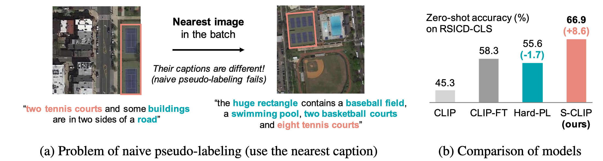
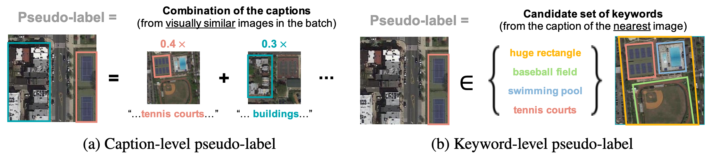
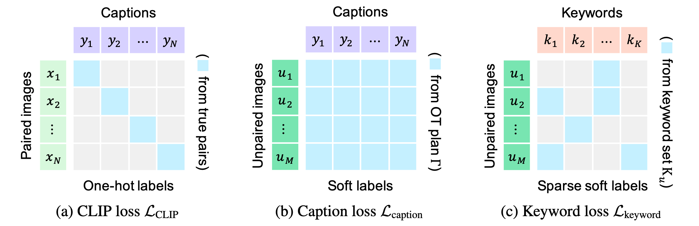

# S-CLIP: Semi-supervised CLIP

Implementation of the S-CLIP algorithm described in
["**S-CLIP: Semi-supervised Vision-Language Pre-training using Few Specialist Captions**."](https://arxiv.org/abs/2305.14095)

S-CLIP improves the training of CLIP in scenarios where only a few image-text pairs are available
by incorporating unpaired images alongside the image-text pairs.

## Motivation
S-CLIP addresses the issue of naive pseudo-labeling in semi-supervised CLIP.


## Method overview
S-CLIP introduces caption-level and keyword-level pseudo-labeling approaches.



## Installation
Our code is based on the [open_clip](https://github.com/mlfoundations/open_clip) library.
The original CLIP training code can be found in the `training` directory,
while our newly developed code is located in the `custom` directory.
The main logic of the proposed training loss is implemented in `custom/loss.py`.

Install the requirements.
```
pip install -r requirements.txt
```

## Training
Run `./scripts/train_RS.sh`.

## Evaluation
Run `./scripts/eval_RS.sh [CKPT-NAME]`.
